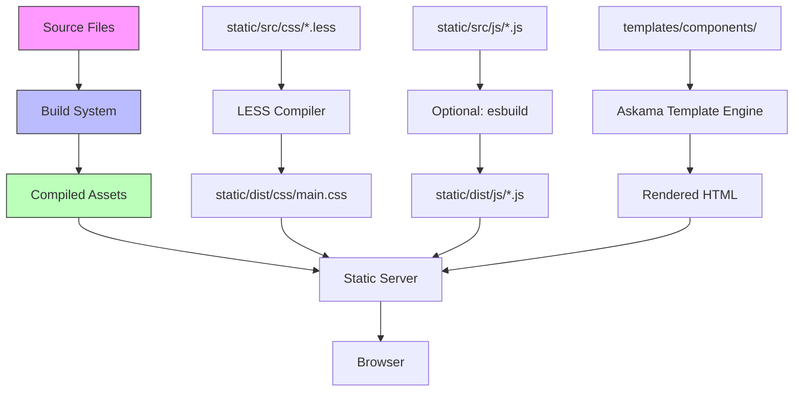

# Design Document: Frontend Refactoring

## Overview

This design outlines the technical architecture for refactoring Mango-Rust's frontend from its current state (inline CSS/JS, scattered files) to a clean, maintainable structure that exceeds the original Mango's quality. The refactoring will reorganize 3,875 lines of frontend code across templates, CSS, and JavaScript while maintaining 100% functional compatibility.

**Key Goals:**
1. Extract 383 lines of inline CSS from base.html into organized LESS files
2. Move reader.css and reader.js from inline includes to static assets
3. Consolidate dark mode styles (scattered across 5+ files) into one source
4. Implement a build system for LESS compilation
5. Create reusable template components to eliminate duplication
6. Optimize Alpine.js usage (reduce by >50% for non-reactive cases)
7. Improve code organization and maintainability

## Steering Document Alignment

### Technical Standards (tech.md)
*Note: No steering docs exist yet - following Rust and web best practices:*

- **Separation of Concerns**: CSS in stylesheets, JS in modules, templates for structure
- **Single Responsibility**: Each file has one clear purpose
- **DRY Principle**: Components eliminate duplication
- **Performance First**: Minified assets, proper caching, optimized loading
- **Maintainability**: Clear file organization, consistent naming, documented patterns

### Project Structure (structure.md)
*Note: Establishing new frontend structure:*

```
static/
  src/          # Source files (not served directly)
    css/
      base.less           # Core layout and typography
      dark-theme.less     # ALL dark mode styles (consolidate from 5+ files)
      components/         # Component-specific styles
        nav.less
        modal.less
        card.less
      pages/              # Page-specific styles
        library.less
        reader.less
        book.less
        home.less
    js/
      core.js             # Shared utilities, theme management
      pages/              # Page-specific modules
        library.js
        reader.js
        book.js
        home.js
        admin.js
  dist/         # Compiled output (served to browser)
    css/
      main.css          # Compiled & minified
      main.css.map      # Source maps
    js/
      main.js           # Bundled & minified
      main.js.map       # Source maps

templates/
  components/   # Reusable template components
    nav.html
    modal-base.html
    card.html
  pages/        # Page templates (moved from root)
    library.html
    book.html
    reader.html
    home.html
  base.html     # Clean base (NO inline CSS/JS)
```

## Code Reuse Analysis

### Existing Code to Leverage

**From Original Mango (`Mango/public/`):**
- **mango.less**: LESS compilation patterns, variable usage
- **common.js**: Theme management, localStorage patterns
- **reader.js**: Alpine.js component structure (3.7k vs our 495 lines - we're overengineered)
- **search.js**: Simple jQuery search pattern (597 lines - simpler than our Alpine version)

**From Current Mango-Rust:**
- **theme.js** (87 lines): Keep theme toggle logic, integrate with core.js
- **UIKit 3.5.9**: Keep existing version for stability (don't upgrade mid-refactor)
- **Alpine.js 3.13.3**: Keep version, but use more selectively
- **Existing templates**: Preserve all functionality, just extract inline code

### Integration Points

**Rust Backend (Unchanged):**
- **Askama templates**: Continue using  for components
- **Static file routes**: `/static/css/*` and `/static/js/*` already configured
- **No Rust code changes**: Backend serves pre-compiled CSS/JS from static/dist/

**Build System:**
- **LESS compiler**: Integrate into development workflow
- **Watch mode**: Auto-recompile on file changes
- **Production build**: Minify + source maps

## Architecture

### Overall Design Pattern: **Component-Based Static Site Generation**

We're adopting the original Mango's approach but modernized:
- **LESS for CSS**: Compile-time processing (like original)
- **Modular JavaScript**: Each page loads only what it needs (like original)
- **Template Components**: Reusable Askama includes (better than ECR)
- **Minimal Alpine.js**: Only for reactive state (tags, modals)



### Modular Design Principles

**1. CSS Organization (LESS Architecture)**

```less
// static/src/css/main.less
@import 'variables';      // Colors, sizes, breakpoints
@import 'base';           // Core layout, typography
@import 'components/nav'; // Navigation component
@import 'components/modal';
@import 'components/card';
@import 'pages/library';  // Page-specific overrides
@import 'pages/reader';
@import 'dark-theme';     // LAST: overrides everything
```

**2. JavaScript Organization**

```javascript
// static/src/js/core.js - Loaded on all pages
- Theme management (from theme.js)
- localStorage utilities
- Common event handlers
- Alpine.js initialization

// static/src/js/pages/library.js - Only on /library
function libraryPage() {
    // Simple vanilla JS search
    document.querySelector('.search-input').addEventListener('input', ...);
}

// static/src/js/pages/reader.js - Only on /reader
function readerComponent() {
    // Alpine.js component for reactive reader state
    return { ... };
}
```

**3. Template Components**

```html
<!-- templates/components/nav.html -->

<nav class="uk-navbar-container" uk-navbar>
    <!-- Single source of truth for navigation -->
    <ul class="uk-navbar-nav">
        <li class="uk-active">
            <a href="/">HOME</a>
        </li>
        <!-- ... -->
    </ul>
</nav>


<!-- templates/base.html -->

{{ nav(home_active, library_active, admin_active, is_admin) }}
```

## Components and Interfaces

### Component 1: CSS Build System

**Purpose:** Compile LESS to optimized CSS

**Files:**
- **Input**: `static/src/css/**/*.less`
- **Output**: `static/dist/css/main.css` (minified)
- **Tool**: `lessc` (Node.js LESS compiler)

**Build Script** (`build-css.sh`):
```bash
#!/bin/bash
lessc static/src/css/main.less static/dist/css/main.css --compress
echo "CSS compiled successfully"
```

**Watch Script** (`watch-css.sh`):
```bash
#!/bin/bash
lessc static/src/css/main.less static/dist/css/main.css --compress --watch
```

**Dependencies:**
- None (standalone Node.js tool)

**Reuses:**
- Original Mango's LESS compilation pattern

---

### Component 2: Core JavaScript Module

**Purpose:** Shared utilities loaded on all pages

**File:** `static/src/js/core.js`

**Public Interface:**
```javascript
// Theme Management
function toggleTheme() { ... }
function applyTheme(theme) { ... }
function getTheme() { ... }

// localStorage Helpers
function savePreference(key, value) { ... }
function loadPreference(key, defaultValue) { ... }

// Initialization
document.addEventListener('DOMContentLoaded', () => {
    // Apply theme before render (prevent FOUC)
    applyTheme(getTheme());
    // Initialize Alpine.js if present
    if (window.Alpine) {
        window.Alpine.start();
    }
});
```

**Dependencies:**
- Browser localStorage API
- Optional: Alpine.js (if loaded on page)

**Reuses:**
- Current `theme.js` logic
- Original Mango's `common.js` patterns

---

### Component 3: Library Page Module

**Purpose:** Library-specific JavaScript (search, sort)

**File:** `static/src/js/pages/library.js`

**Public Interface:**
```javascript
// Search functionality (vanilla JS, not Alpine)
function initLibrarySearch() {
    const searchInput = document.querySelector('.uk-search-input');
    const cards = document.querySelectorAll('.title-card');

    searchInput.addEventListener('input', (e) => {
        const query = e.target.value.toLowerCase();
        cards.forEach(card => {
            const name = card.dataset.titleName.toLowerCase();
            card.style.display = name.includes(query) ? '' : 'none';
        });
    });
}

// Sort functionality (persisted to localStorage)
function initLibrarySort() {
    const sortSelect = document.querySelector('.sort-select');
    const saved = loadPreference('library-sort', 'name');
    sortSelect.value = saved;

    sortSelect.addEventListener('change', (e) => {
        savePreference('library-sort', e.target.value);
        window.location.reload(); // Server-side sort
    });
}

// Page initialization
document.addEventListener('DOMContentLoaded', () => {
    initLibrarySearch();
    initLibrarySort();
});
```

**Dependencies:**
- `core.js` (for savePreference/loadPreference)

**Reuses:**
- Original Mango's `search.js` approach (simpler than Alpine)

---

### Component 4: Reader Page Module

**Purpose:** Reader-specific JavaScript (page navigation, settings)

**File:** `static/src/js/pages/reader.js`

**Public Interface:**
```javascript
// Alpine.js component (reactive state needed here)
function readerComponent() {
    return {
        currentPage: {{ page }},
        totalPages: {{ total_pages }},
        pages: [],

        // Navigate to page
        goToPage(num) {
            window.location.href = `/reader/{{ title_id }}/{{ entry_id }}/${num}`;
        },

        // Keyboard shortcuts
        init() {
            document.addEventListener('keydown', (e) => {
                if (e.key === 'ArrowRight') this.nextPage();
                if (e.key === 'ArrowLeft') this.prevPage();
            });
        },

        nextPage() {
            if (this.currentPage < this.totalPages) {
                this.goToPage(this.currentPage + 1);
            }
        },

        prevPage() {
            if (this.currentPage > 1) {
                this.goToPage(this.currentPage - 1);
            }
        }
    };
}
```

**Dependencies:**
- Alpine.js (reactive state management)
- Server-rendered template variables

**Reuses:**
- Original Mango's `reader.js` Alpine.js pattern (but simpler)

---

### Component 5: Template Navigation Component

**Purpose:** Single source of truth for navigation across desktop and mobile

**File:** `templates/components/nav.html`

**Public Interface:**
```jinja2

    <!-- Desktop Navigation -->
    <nav class="uk-navbar-container uk-visible@m">
        <ul class="uk-navbar-nav">
            <li class="uk-active">
                <a href="/">Home</a>
            </li>
            <!-- ... other items ... -->
        </ul>
    </nav>

    <!-- Mobile Navigation (same items, different styling) -->
    <div id="mobile-nav" uk-offcanvas>
        <ul class="uk-nav">
            <li class="uk-active">
                <a href="/">Home</a>
            </li>
            <!-- ... same items ... -->
        </ul>
    </div>

```

**Usage in base.html:**
```jinja2

{{ nav("home", is_admin) }}
```

**Dependencies:**
- Askama template engine
- UIKit CSS for styling

**Reuses:**
- Current navigation HTML structure
- Consolidates desktop + mobile into one component

---

### Component 6: Dark Theme LESS Module

**Purpose:** ALL dark mode styles in one file

**File:** `static/src/css/dark-theme.less`

**Structure:**
```less
// Dark theme color variables
@dark-bg: rgb(20, 20, 20);
@dark-bg-elevated: #2a2a2a;
@dark-bg-input: #1a1a1a;
@dark-border: #3a3a3a;
@dark-text-primary: #e5e5e5;
@dark-text-secondary: #aaa;

// Global dark mode
body.uk-light {
    background: @dark-bg;
    color: @dark-text-primary;

    // Navigation
    .uk-navbar-container {
        background: @dark-bg-elevated !important;
        border-bottom: 1px solid @dark-border;
    }

    // Forms
    .uk-input, .uk-textarea, .uk-select {
        background: @dark-bg-input;
        border-color: @dark-border;
        color: @dark-text-primary;
    }

    // Modals
    .uk-modal-dialog {
        background: @dark-bg-elevated;
        color: @dark-text-primary;
    }

    // ... (all dark mode styles from base.html lines 110-317)
}
```

**Dependencies:**
- LESS compiler
- `variables.less` for color definitions

**Reuses:**
- Existing dark mode styles from base.html
- Consolidates styles from library.css, book.css, home.css

## Data Models

### CSS Variables Model
```less
// variables.less
@primary-color: #1e87f0;
@background-light: #fafafa;
@background-dark: rgb(20, 20, 20);
@text-light: #333;
@text-dark: #e5e5e5;
@breakpoint-small: 640px;
@breakpoint-medium: 960px;
@breakpoint-large: 1200px;
```

### JavaScript State Model (Reader)
```javascript
{
    currentPage: number,
    totalPages: number,
    titleId: string,
    entryId: string,
    pages: Array<{ id: number, url: string }>,
    loading: boolean
}
```

### Template Data Model (Navigation)
```rust
struct NavData {
    active_page: String,      // "home" | "library" | "admin"
    is_admin: bool,
    username: String
}
```

## Error Handling

### Scenario 1: LESS Compilation Failure

**Description:** Developer edits invalid LESS syntax

**Handling:**
```bash
# watch-css.sh
lessc static/src/css/main.less static/dist/css/main.css --compress 2>&1 | tee /dev/stderr
if [ $? -ne 0 ]; then
    echo "ERROR: LESS compilation failed. Check syntax."
    exit 1
fi
```

**User Impact:** Development server continues running, error shown in terminal

---

### Scenario 2: Missing Static File in Production

**Description:** Compiled CSS/JS not deployed

**Handling:**
- Rust returns 404 for missing static files
- Browser console shows error
- Fallback: Inline critical CSS in base.html (emergency)

**User Impact:** Page loads but unstyled (graceful degradation)

---

### Scenario 3: JavaScript Module Load Failure

**Description:** Network error loading JS file

**Handling:**
```html
<script src="/static/js/core.js" onerror="console.error('Failed to load core.js')"></script>
```

**User Impact:** Core features work (server-rendered), advanced features unavailable

## Testing Strategy

### Unit Testing

**CSS Visual Regression:**
- Screenshot tests for each page in light/dark mode
- Compare before/after refactoring
- Tools: Playwright MCP + pixel comparison

**JavaScript Unit Tests:**
- Test theme toggle function
- Test localStorage helpers
- Test search filter logic
- Tool: Manual Playwright testing (no test framework needed for now)

### Integration Testing

**Build System:**
1. Modify LESS file
2. Verify CSS recompiles
3. Verify minification works
4. Verify source maps generated

**Template Components:**
1. Modify nav component
2. Verify changes appear on all pages
3. Verify mobile and desktop both update

### End-to-End Testing

**User Scenarios (via Playwright MCP):**

1. **Library Search**
   - Load /library
   - Type in search box
   - Verify cards filter correctly
   - Compare to current behavior (must be identical)

2. **Theme Toggle**
   - Load /library in light mode
   - Click theme toggle
   - Verify dark mode applied
   - Reload page, verify persists
   - Navigate to /book, verify still dark

3. **Reader Navigation**
   - Load /reader page
   - Press right arrow key
   - Verify advances to next page
   - Verify progress saved
   - Compare to current behavior

4. **Mobile Navigation**
   - Resize browser to <960px
   - Verify hamburger menu appears
   - Click hamburger
   - Verify offcanvas opens
   - Click nav item
   - Verify navigation works

5. **Dark Mode Across Pages**
   - Enable dark mode on /library
   - Navigate to /book
   - Verify dark mode persists
   - Navigate to /reader
   - Verify dark mode persists
   - Check modals are dark themed

## Build System Implementation

### Development Workflow

```bash
# Install LESS compiler (one-time)
npm install -g less

# Development mode (auto-recompile on changes)
./watch-css.sh &
cargo watch -x run

# Production build
./build-css.sh
cargo build --release
```

### Build Scripts

**`watch-css.sh`:**
```bash
#!/bin/bash
echo "Watching LESS files for changes..."
lessc --watch static/src/css/main.less static/dist/css/main.css --compress --source-map
```

**`build-css.sh`:**
```bash
#!/bin/bash
echo "Building CSS..."
mkdir -p static/dist/css
lessc static/src/css/main.less static/dist/css/main.css --compress --source-map
echo "✓ CSS compiled to static/dist/css/main.css"
```

**Add to `.gitignore`:**
```
static/dist/
node_modules/
```

**Add to README.md:**
```markdown
## Frontend Development

### Prerequisites
- Node.js (for LESS compiler)

### Setup
npm install -g less

### Development
./watch-css.sh    # Auto-recompile CSS on changes
cargo watch -x run # Auto-restart server on Rust changes

### Production Build
./build-css.sh
cargo build --release
```

## Migration Path

### Phase 1: Setup Build System
1. Create `static/src/css/` and `static/dist/css/` directories
2. Create build scripts (`build-css.sh`, `watch-css.sh`)
3. Test compilation works

### Phase 2: Extract Base CSS
1. Copy inline CSS from base.html to `base.less`
2. Update base.html to load compiled CSS
3. Verify pages render identically

### Phase 3: Extract Dark Theme
1. Extract dark mode styles to `dark-theme.less`
2. Remove from base.html, library.css, book.css, home.css
3. Test theme toggle works

### Phase 4: Extract Page CSS
1. Move page-specific styles to `pages/*.less`
2. Import in main.less
3. Test each page individually

### Phase 5: Create Template Components
1. Extract navigation to `components/nav.html`
2. Update base.html to use component
3. Remove duplicate mobile nav code

### Phase 6: Organize JavaScript
1. Move reader.js to static/src/js/pages/
2. Extract shared code to core.js
3. Update script tags in templates

### Phase 7: Optimize Alpine.js
1. Replace simple Alpine usage with vanilla JS (library search)
2. Keep Alpine for reactive components (reader, tags)
3. Test all interactions work

### Phase 8: Final Polish
1. Minify CSS/JS
2. Add source maps
3. Performance testing
4. Visual regression testing

## Performance Targets

**Before Refactoring:**
- base.html: 383 lines (including 300+ lines of CSS)
- Total CSS: ~1,200 lines across multiple files
- JavaScript: Inline + scattered modules

**After Refactoring:**
- base.html: ~100 lines (pure structure, no styles)
- Compiled CSS: <50KB gzipped
- Compiled JS: <100KB total
- First Contentful Paint: <1s on 3G
- Time to Interactive: <2s on 3G

## Risks and Mitigation

**Risk 1: Breaking Visual Appearance**
- **Mitigation**: Screenshot testing before/after each phase
- **Fallback**: Git revert if issues found

**Risk 2: LESS Compilation Complexity**
- **Mitigation**: Keep LESS simple (no advanced features)
- **Fallback**: Can compile manually if watch fails

**Risk 3: Template Component Complexity**
- **Mitigation**: Start with simple components (nav only)
- **Fallback**: Keep existing templates if components problematic

**Risk 4: Alpine.js Removal Breaking Features**
- **Mitigation**: Test each replacement thoroughly
- **Fallback**: Keep Alpine where truly needed

## Success Metrics

The refactoring is successful when:

1. ✅ **Zero inline CSS** in any template (<style> tags removed)
2. ✅ **Zero inline JavaScript** using  (proper <script src> instead)
3. ✅ **Build system works** (LESS compiles automatically)
4. ✅ **Visual parity** (screenshots match pixel-for-pixel)
5. ✅ **Functional parity** (all features work identically)
6. ✅ **Performance improvement** (CSS <50KB, faster loads)
7. ✅ **Code reduction** (30% fewer template lines via components)
8. ✅ **Maintainability** (developers can find/modify code easily)
9. ✅ **Linus approval** (or at least fewer complaints)

## Conclusion

This design transforms Mango-Rust's frontend from a tangled mess of inline styles and scattered JavaScript into a clean, maintainable architecture that exceeds the original Mango's quality. By adopting LESS compilation, creating reusable components, and organizing code logically, we make the codebase easier to understand, modify, and extend.

The migration path is conservative and incremental, testing each phase before proceeding. The result will be a frontend that's not just as good as the original Mango—it will be better.
