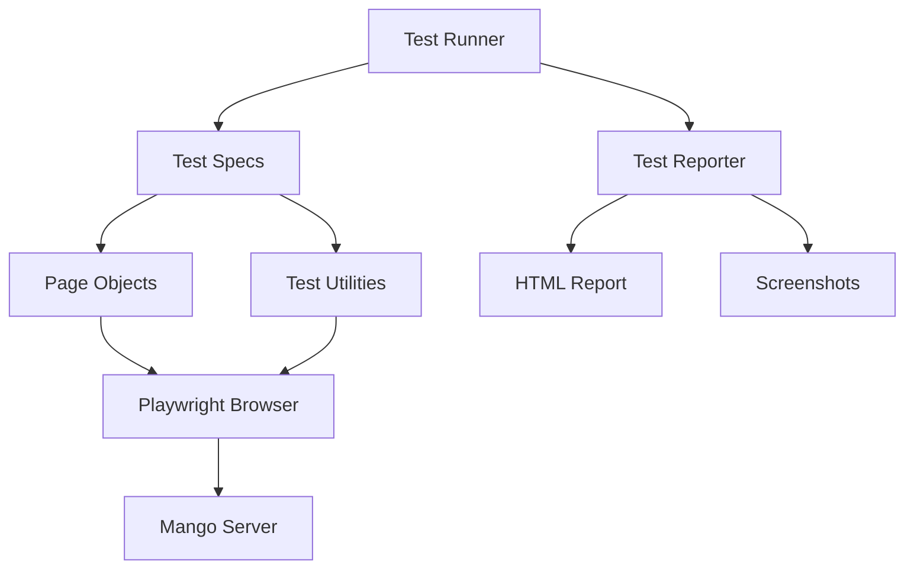

# Design Document: Integration Testing Framework

## Overview

The Integration Testing Framework will provide automated, browser-based tests for Mango-Rust using Playwright. The framework will be built as a standalone Node.js test suite that interacts with the running Mango server, verifying frontend-backend interactions, theme system, reader functionality, and navigation flows.

The testing framework will follow a modular architecture with reusable utilities, organized test suites, and comprehensive reporting capabilities. Tests will run both locally during development and automatically in CI/CD pipelines.

## Steering Document Alignment

### Technical Standards (tech.md)

*Note: Steering documents not yet created. This design follows general best practices for test frameworks.*

**Testing Standards:**
- Use industry-standard tools (Playwright for browser automation)
- Follow page object pattern for maintainable tests
- Separate test utilities from test specifications
- Use TypeScript for type safety and better IDE support

### Project Structure (structure.md)

**Test Organization:**
```
tests/
├── integration/           # Integration test suites
│   ├── theme.spec.ts     # Theme toggle tests
│   ├── reader.spec.ts    # Reader functionality tests
│   ├── navigation.spec.ts # Page navigation tests
│   └── auth.spec.ts      # Authentication tests
├── helpers/              # Reusable test utilities
│   ├── test-utils.ts     # Common test helpers
│   ├── page-objects.ts   # Page object models
│   └── fixtures.ts       # Test fixtures and data
├── reports/              # Test execution reports (gitignored)
└── screenshots/          # Test evidence (gitignored)
```

## Code Reuse Analysis

### Existing Components to Leverage

- **Playwright MCP Server**: Already integrated in Claude Code environment, provides browser automation capabilities
- **Build Scripts**: `build-css.sh` will be used to ensure CSS is compiled before tests run
- **Server Binary**: `cargo run --release` used to start Mango server for testing

### Integration Points

- **Running Mango Server**: Tests will start server on localhost:9000 and wait for readiness
- **Database**: Tests will use temporary test database to avoid affecting development data
- **Static Assets**: Tests will verify `/static/dist/css/main.css` and `/static/js/core.js` load correctly
- **LocalStorage**: Tests will interact with browser localStorage for theme preferences
- **Session Management**: Tests will authenticate and maintain sessions for protected pages

## Architecture

The testing framework follows a **layered architecture** with clear separation of concerns:



### Modular Design Principles

- **Single File Responsibility**: Each test file tests one feature area (theme, reader, navigation)
- **Component Isolation**: Page objects encapsulate page-specific selectors and interactions
- **Service Layer Separation**: Test utilities provide reusable functions independent of specific pages
- **Utility Modularity**: Helpers broken into focused modules (assertions, waits, screenshots, setup)

### Design Patterns

1. **Page Object Pattern**: Encapsulate page structures and interactions
2. **Test Fixtures**: Provide consistent test setup and teardown
3. **Builder Pattern**: Construct complex test scenarios incrementally
4. **Helper Functions**: Extract common patterns into reusable utilities

## Components and Interfaces

### Component 1: Test Runner Configuration

- **Purpose:** Configure Playwright test runner with browsers, timeouts, and reporters
- **Interfaces:**
  - `playwright.config.ts`: Playwright configuration file
  - Exports test options, browser settings, base URL
- **Dependencies:** Playwright Test framework
- **Reuses:** Standard Playwright configuration patterns

**Configuration Options:**
```typescript
{
  testDir: './tests/integration',
  timeout: 30000,
  retries: 2,
  use: {
    baseURL: 'http://localhost:9000',
    screenshot: 'only-on-failure',
    video: 'retain-on-failure'
  }
}
```

### Component 2: Page Objects

- **Purpose:** Encapsulate page-specific selectors and interactions
- **Interfaces:**
  - `LibraryPage`: Navigate, search, sort, verify titles
  - `BookPage`: View entries, open modals, manage tags, check progress
  - `ReaderPage`: Navigate pages, change modes, verify images load
  - `NavigationComponent`: Toggle theme, navigate menu, verify active page
- **Dependencies:** Playwright Page API
- **Reuses:** Common selector patterns, wait strategies

**Interface Example:**
```typescript
class LibraryPage {
  constructor(page: Page);
  async navigate(): Promise<void>;
  async search(query: string): Promise<void>;
  async selectSort(option: string): Promise<void>;
  async getTitleCards(): Promise<ElementHandle[]>;
  async verifyTitleExists(name: string): Promise<boolean>;
}
```

### Component 3: Test Utilities

- **Purpose:** Provide reusable helper functions for common test operations
- **Interfaces:**
  - `login(page, username, password)`: Authenticate user
  - `verifyTheme(page, expectedTheme)`: Check current theme state
  - `captureEvidence(page, name)`: Take screenshot and save console logs
  - `waitForPageLoad(page)`: Wait for page to be fully loaded
  - `startServer()`: Launch Mango server and wait for ready
  - `stopServer()`: Gracefully shutdown server
- **Dependencies:** Playwright Page API, Node.js child_process
- **Reuses:** Standard wait strategies, assertion patterns

**Utility Functions:**
```typescript
// Theme verification
async function verifyTheme(page: Page, expected: 'light' | 'dark'): Promise<void> {
  const hasUkLight = await page.evaluate(() =>
    document.body.classList.contains('uk-light')
  );
  const theme = await page.evaluate(() =>
    localStorage.getItem('theme')
  );

  if (expected === 'dark') {
    expect(hasUkLight).toBe(true);
    expect(theme).toBe('dark');
  } else {
    expect(hasUkLight).toBe(false);
    expect(theme).toBe('light');
  }
}

// Server management
async function startServer(): Promise<ChildProcess> {
  const server = spawn('cargo', ['run', '--release'], {
    cwd: projectRoot,
    env: { ...process.env, RUST_LOG: 'info' }
  });

  await waitForServerReady('http://localhost:9000');
  return server;
}
```

### Component 4: Test Fixtures

- **Purpose:** Provide consistent test setup and teardown
- **Interfaces:**
  - `test.beforeAll()`: Start server, build CSS
  - `test.afterAll()`: Stop server, clean up temp files
  - `test.beforeEach()`: Navigate to page, clear localStorage
  - `test.afterEach()`: Capture screenshots on failure
- **Dependencies:** Playwright Test hooks
- **Reuses:** Test utilities for server/browser management

### Component 5: Test Suites

- **Purpose:** Organize tests by feature area
- **Interfaces:**
  - `theme.spec.ts`: Theme toggle, persistence, visual verification
  - `reader.spec.ts`: Page navigation, mode switching, keyboard shortcuts
  - `navigation.spec.ts`: Menu links, page routing, active states
  - `auth.spec.ts`: Login, logout, session persistence
- **Dependencies:** Page objects, test utilities
- **Reuses:** Common test fixtures and helpers

## Data Models

### TestConfig

```typescript
interface TestConfig {
  baseURL: string;           // Server URL (e.g., 'http://localhost:9000')
  timeout: number;           // Default test timeout in ms
  retries: number;           // Number of retries on failure
  headless: boolean;         // Run browser in headless mode
  slowMo: number;            // Slow down operations for debugging
  screenshotDir: string;     // Directory for test screenshots
  reportDir: string;         // Directory for HTML reports
}
```

### PageState

```typescript
interface PageState {
  url: string;               // Current page URL
  title: string;             // Page title
  theme: 'light' | 'dark';   // Current theme
  isAuthenticated: boolean;  // User logged in?
  consoleErrors: string[];   // JavaScript errors on page
}
```

### TestResult

```typescript
interface TestResult {
  testName: string;          // Name of test
  status: 'passed' | 'failed' | 'skipped';
  duration: number;          // Test execution time (ms)
  error?: string;            // Error message if failed
  screenshots: string[];     // Paths to screenshots
  retries: number;           // Number of retries attempted
}
```

## Error Handling

### Error Scenarios

1. **Server fails to start**
   - **Handling:** Retry 3 times with exponential backoff, fail suite if still unsuccessful
   - **User Impact:** Clear error message indicating server startup failed, suggest checking if port 9000 is in use

2. **Page load timeout**
   - **Handling:** Retry once, capture network logs, take screenshot
   - **User Impact:** Test fails with screenshot showing loading state, network log shows which resource failed

3. **Element not found**
   - **Handling:** Wait with retry (5 seconds), take screenshot if still not found
   - **User Impact:** Clear error message showing which element was not found and page snapshot

4. **Theme toggle doesn't work**
   - **Handling:** Capture before/after screenshots, dump localStorage state, fail test
   - **User Impact:** Visual evidence of what went wrong with theme system

5. **JavaScript console errors**
   - **Handling:** Collect all console.error messages, include in test report
   - **User Impact:** Test report shows which pages have JavaScript errors

6. **Database connection failed**
   - **Handling:** Check if test database exists, create if missing, retry connection
   - **User Impact:** Informative error about database setup

## Testing Strategy

### Unit Testing

**Not applicable** - This spec is for integration testing framework itself. The framework will enable integration tests for Mango-Rust features.

### Integration Testing

**Core Flows to Test:**

1. **Theme System Flow**
   - Load page in default theme
   - Click theme toggle
   - Verify body class changes
   - Verify localStorage updates
   - Verify colors change (navbar, cards, text)
   - Refresh page
   - Verify theme persists
   - Navigate to different page
   - Verify theme remains consistent

2. **Reader Functionality Flow**
   - Navigate to book page
   - Click entry to open reader
   - Verify reader loads without JS errors
   - Verify first page displays
   - Press right arrow key
   - Verify page changes
   - Open settings modal
   - Change reading mode to continuous
   - Verify mode switches correctly
   - Verify all pages load in continuous mode

3. **Authentication Flow**
   - Navigate to login page
   - Enter credentials
   - Submit form
   - Verify redirect to library
   - Verify session cookie set
   - Navigate to protected page
   - Verify access granted
   - Click logout
   - Verify redirect to login
   - Attempt to access protected page
   - Verify redirect to login

4. **Navigation Flow**
   - Click each main nav link (Library, Tags, Admin)
   - Verify correct page loads
   - Verify active nav item highlighted
   - Test mobile hamburger menu
   - Verify offcanvas opens
   - Click mobile nav link
   - Verify navigation works

### End-to-End Testing

**User Scenarios:**

1. **Complete Reading Session**
   - User logs in
   - Browses library
   - Searches for title
   - Opens book
   - Starts reading entry
   - Reads multiple pages
   - Closes reader
   - Verifies progress saved
   - Logs out

2. **Theme Customization**
   - User opens site
   - System detects preferred theme
   - User toggles theme multiple times
   - User navigates across pages
   - Theme preference persists
   - User returns next day
   - Theme preference still saved

3. **Library Management**
   - Admin logs in
   - Navigates to admin page
   - Initiates library scan
   - Waits for scan completion
   - Returns to library
   - Verifies new titles appear
   - Searches for new title
   - Confirms it's accessible

## Technology Stack

### Test Framework
- **Playwright** (latest): Browser automation and testing framework
  - Supports Chromium, Firefox, WebKit
  - Built-in test runner with parallel execution
  - Screenshot and video capture
  - Network interception
  - Mobile viewport simulation

### Language
- **TypeScript 5.x**: Type-safe test code
  - Better IDE support (autocomplete, refactoring)
  - Catch errors at compile time
  - Self-documenting code with types

### Reporting
- **Playwright HTML Reporter**: Visual test reports with screenshots
- **Playwright JSON Reporter**: Machine-readable results for CI integration

### Development Tools
- **ESLint**: Code quality and style enforcement
- **Prettier**: Code formatting
- **ts-node**: Run TypeScript directly without compilation

## File Structure

```
tests/
├── playwright.config.ts          # Playwright configuration
├── package.json                  # Node.js dependencies
├── tsconfig.json                 # TypeScript configuration
├── .eslintrc.json               # ESLint configuration
├── integration/                  # Test suites
│   ├── theme.spec.ts            # Theme toggle tests
│   ├── reader.spec.ts           # Reader functionality tests
│   ├── navigation.spec.ts       # Navigation tests
│   ├── auth.spec.ts             # Authentication tests
│   └── library.spec.ts          # Library search/sort tests
├── helpers/                      # Reusable utilities
│   ├── test-utils.ts            # General test helpers
│   ├── page-objects.ts          # Page object models
│   ├── fixtures.ts              # Test fixtures
│   ├── assertions.ts            # Custom assertions
│   └── server.ts                # Server start/stop utilities
├── reports/                      # Test reports (gitignored)
│   ├── index.html               # HTML test report
│   └── results.json             # JSON test results
└── screenshots/                  # Test evidence (gitignored)
    ├── theme-toggle-before.png
    └── theme-toggle-after.png
```

## CI/CD Integration

### GitHub Actions Workflow

```yaml
name: Integration Tests

on: [pull_request, push]

jobs:
  integration-tests:
    runs-on: ubuntu-latest

    steps:
      - uses: actions/checkout@v4

      - name: Install Rust
        uses: actions-rs/toolchain@v1
        with:
          toolchain: stable

      - name: Install Node.js
        uses: actions/setup-node@v4
        with:
          node-version: '20'

      - name: Install dependencies
        run: |
          npm install --prefix tests
          npx playwright install --with-deps chromium

      - name: Build CSS
        run: ./build-css.sh

      - name: Run integration tests
        run: npm test --prefix tests

      - name: Upload test results
        if: always()
        uses: actions/upload-artifact@v4
        with:
          name: playwright-report
          path: tests/reports/

      - name: Upload screenshots
        if: failure()
        uses: actions/upload-artifact@v4
        with:
          name: test-screenshots
          path: tests/screenshots/
```

## Performance Considerations

- **Parallel Test Execution**: Run independent tests in parallel (estimated 60% time reduction)
- **Browser Reuse**: Share browser context between tests when possible
- **Selective Screenshots**: Only capture screenshots on failure (reduce disk I/O)
- **Headless Mode**: Run tests in headless browsers in CI (faster startup)
- **Smart Retries**: Retry only flaky tests, not systematic failures
- **Resource Cleanup**: Always close browsers and stop servers in teardown

## Security Considerations

- **Test Credentials**: Use dedicated test account, never production credentials
- **Test Database**: Isolated test database, never connect to production
- **Secrets Management**: Store test credentials in environment variables or CI secrets
- **Port Isolation**: Use non-standard ports for test server to avoid conflicts

## Maintenance and Scalability

- **Page Object Updates**: When UI changes, update centralized page objects
- **Test Modularity**: Add new tests by reusing existing helpers and fixtures
- **Backward Compatibility**: Test utilities maintain stable interfaces
- **Documentation**: Each test file includes JSDoc comments explaining purpose
- **Regular Review**: Monthly review of flaky tests and execution times
