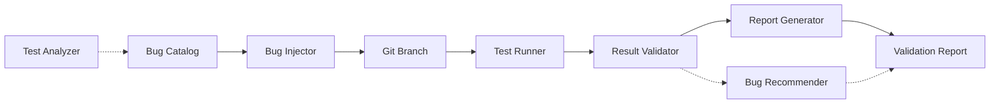

# Design Document: Test Validation Framework

## Overview

The Test Validation Framework is a mutation testing-inspired system that validates the effectiveness of our 50 integration tests by systematically injecting bugs and verifying that tests fail as expected. This framework ensures our 100% test pass rate represents real quality, not false confidence.

The framework will operate as a standalone TypeScript/Node.js tool that:
1. Analyzes test files to understand what they're testing
2. Injects specific bugs into source code via git branches
3. Runs individual tests against buggy code
4. Validates tests detect the bugs (mark as STRONG) or fail to detect them (mark as WEAK)
5. Generates comprehensive reports with improvement recommendations

## Steering Document Alignment

### Technical Standards (tech.md)

*Note: Steering documents not yet created. This design follows general best practices for testing validation.*

**Testing Quality Standards:**
- Validate tests actually catch bugs (mutation testing principle)
- Automated, repeatable validation process
- Data-driven bug catalog (YAML/JSON configuration)
- Clean git branch management with automatic cleanup
- Comprehensive reporting for actionable insights

### Project Structure (structure.md)

**Framework Organization:**
```
tests/
├── validation/                    # Test validation framework
│   ├── bug-catalog.yaml          # Bug definitions for each test
│   ├── validator.ts              # Main validation orchestrator
│   ├── bug-injector.ts           # Git branch & code mutation logic
│   ├── test-runner.ts            # Execute individual tests
│   ├── report-generator.ts       # Generate validation reports
│   └── analyzers/                # Test analysis utilities
│       ├── test-parser.ts        # Parse test files to understand intent
│       └── bug-recommender.ts    # Suggest bugs for tests
├── integration/                   # Existing integration tests (50 tests)
└── .validation-results/          # Validation run results (gitignored)
    ├── run-TIMESTAMP/
    │   ├── validation-report.md
    │   ├── results.json
    │   └── logs/
    └── latest -> run-TIMESTAMP
```

## Code Reuse Analysis

### Existing Components to Leverage

- **Playwright Test Framework**: Reuse existing test infrastructure and runner
- **Git Operations**: Use simple-git npm package for branch management
- **TypeScript Configuration**: Leverage existing tsconfig.json from tests/
- **Test Helpers**: Reuse tests/helpers/ utilities for server management

### Integration Points

- **Test Files**: Read and parse `tests/integration/*.spec.ts` to understand test intent
- **Source Code**: Inject bugs into `src/**/*.rs`, `templates/**/*.html`, `static/**/*.js`
- **Git Repository**: Create temporary validation branches, ensure clean state
- **Playwright Runner**: Execute specific tests via `npx playwright test --grep`
- **CI/CD**: Future integration with GitHub Actions for automated validation

## Architecture

The framework follows a **pipeline architecture** with clear stages:



### Modular Design Principles

- **Single File Responsibility**: Each module handles one stage of validation pipeline
- **Component Isolation**: Bug injection, test execution, and reporting are independent
- **Data-Driven Design**: Bug catalog is declarative YAML, not hardcoded logic
- **Clean State Management**: Git operations are atomic and reversible

### Design Patterns

1. **Strategy Pattern**: Different bug injection strategies (replace, delete, comment)
2. **Builder Pattern**: Construct validation reports incrementally
3. **Command Pattern**: Each bug injection is a reversible command (git branch)
4. **Observer Pattern**: Track validation progress and emit events

## Components and Interfaces

### Component 1: Bug Catalog (YAML Data)

- **Purpose:** Declarative definition of bugs to inject for each test
- **Format:** YAML file mapping test names to bug definitions
- **Schema:**
  ```yaml
  test-id: "theme.spec.ts:45:3"
  test-name: "should toggle theme on library page"
  functionality: "Theme toggle updates body class and localStorage"
  bugs:
    - id: "theme-toggle-1"
      description: "Remove uk-light class toggle"
      target-file: "static/js/core.js"
      strategy: "replace"
      find: "document.body.classList.toggle('uk-light');"
      replace: "// BUG: Disabled class toggle"
      expected-failure: "expect(hasUkLight).toBe(true)"
    - id: "theme-toggle-2"
      description: "Prevent localStorage update"
      target-file: "static/js/core.js"
      strategy: "replace"
      find: "localStorage.setItem('theme', newTheme);"
      replace: "// BUG: localStorage not updated"
      expected-failure: "expect(theme).toBe('dark')"
  ```

### Component 2: Bug Injector

- **Purpose:** Apply code changes to inject bugs via git branches
- **Interfaces:**
  - `async injectBug(bug: BugDefinition): Promise<BranchInfo>`
  - `async revertBug(branchInfo: BranchInfo): Promise<void>`
- **Dependencies:** simple-git, fs
- **Strategy Types:**
  - `replace`: Find/replace string in file
  - `delete`: Remove lines matching pattern
  - `comment`: Comment out matching lines

**Interface:**
```typescript
interface BugDefinition {
  id: string;
  description: string;
  targetFile: string;
  strategy: 'replace' | 'delete' | 'comment';
  find: string;
  replace?: string;  // For 'replace' strategy
  expectedFailure?: string;  // Hint for report
}

interface BranchInfo {
  branchName: string;  // e.g., "test-validation/theme-toggle/bug-1"
  originalBranch: string;
  bugId: string;
  timestamp: number;
}

class BugInjector {
  async createBugBranch(bug: BugDefinition): Promise<BranchInfo>;
  async applyBugChange(bug: BugDefinition): Promise<void>;
  async switchBack(branchInfo: BranchInfo): Promise<void>;
  async cleanup(branchInfo: BranchInfo): Promise<void>;
}
```

### Component 3: Test Runner

- **Purpose:** Execute individual Playwright tests and capture results
- **Interfaces:**
  - `async runSingleTest(testSpec: TestSpec): Promise<TestResult>`
  - `parseTestOutput(stdout: string): TestResult`
- **Dependencies:** child_process, Playwright
- **Execution:** `npx playwright test --grep "<test-name>"`

**Interface:**
```typescript
interface TestSpec {
  file: string;           // e.g., "theme.spec.ts"
  testName: string;       // e.g., "should toggle theme on library page"
  fullId: string;         // e.g., "theme.spec.ts:45:3"
}

interface TestResult {
  passed: boolean;
  duration: number;       // milliseconds
  exitCode: number;
  stdout: string;
  stderr: string;
  error?: string;
}

class TestRunner {
  async runTest(spec: TestSpec): Promise<TestResult>;
  async parseOutput(output: string): TestResult;
}
```

### Component 4: Validation Orchestrator

- **Purpose:** Coordinate the entire validation workflow
- **Interfaces:**
  - `async validateAllTests(): Promise<ValidationRun>`
  - `async validateSingleTest(testId: string): Promise<ValidationResult>`
- **Dependencies:** BugInjector, TestRunner, ReportGenerator
- **Workflow:**
  1. Load bug catalog
  2. For each test:
     - Inject bug → create branch
     - Run test → capture result
     - Validate: test should FAIL
     - Revert → delete branch
  3. Generate report

**Interface:**
```typescript
interface ValidationResult {
  testId: string;
  testName: string;
  bugId: string;
  testPassed: boolean;        // Did test pass (bad) or fail (good)?
  validation: 'STRONG' | 'WEAK';  // WEAK = test passed despite bug
  duration: number;
  error?: string;
  output: string;
}

interface ValidationRun {
  timestamp: string;
  totalTests: number;
  strongTests: number;        // Detected bug (good)
  weakTests: number;          // Missed bug (bad)
  results: ValidationResult[];
  duration: number;
}

class ValidationOrchestrator {
  async validateAll(): Promise<ValidationRun>;
  async validateTest(testSpec: TestSpec, bugs: BugDefinition[]): Promise<ValidationResult[]>;
}
```

### Component 5: Report Generator

- **Purpose:** Generate human-readable validation reports with recommendations
- **Interfaces:**
  - `async generateMarkdownReport(run: ValidationRun): Promise<string>`
  - `async generateJSONReport(run: ValidationRun): Promise<string>`
- **Dependencies:** ValidationRun data
- **Output:** Markdown report with:
  - Summary statistics (STRONG vs WEAK tests)
  - Detailed results per test
  - Recommendations for weak tests

**Report Structure:**
```markdown
# Test Validation Report

**Run Time:** 2025-11-23 16:30:00
**Duration:** 12 minutes 34 seconds

## Summary

- **Total Tests Validated:** 50
- **STRONG Tests:** 47 (94%)  ✅
- **WEAK Tests:** 3 (6%)      ⚠️

## Weak Tests (Need Improvement)

### ❌ WEAK: `theme.spec.ts:45:3` - should toggle theme on library page

**Bug Injected:** Removed uk-light class toggle
**Result:** Test PASSED (expected FAIL)
**Issue:** Test doesn't verify body class changes, only checks localStorage

**Recommendation:**
Add assertion to verify body class:
```typescript
const hasUkLight = await page.evaluate(() =>
  document.body.classList.contains('uk-light')
);
expect(hasUkLight).toBe(true);
```

## Strong Tests

### ✅ STRONG: `reader.spec.ts:101:3` - should navigate pages with keyboard

**Bug Injected:** Disabled right arrow key handler
**Result:** Test FAILED as expected ✅
```

### Component 6: Test Analyzer (Future Enhancement)

- **Purpose:** Automatically analyze tests to suggest bug injections
- **Interfaces:**
  - `analyzeTest(testFile: string): BugSuggestion[]`
- **Strategy:** Parse test file, identify assertions, suggest corresponding bugs
- **Reuses:** TypeScript AST parser

## Data Models

### BugCatalog
```typescript
interface BugCatalog {
  version: string;
  generatedAt: string;
  tests: TestValidationEntry[];
}

interface TestValidationEntry {
  testId: string;           // Unique identifier
  testName: string;         // Human-readable name
  testFile: string;         // File path
  functionality: string;    // What the test validates
  bugs: BugDefinition[];    // Bugs to inject
}
```

### ValidationReport
```typescript
interface ValidationReport {
  summary: ValidationSummary;
  weakTests: WeakTestReport[];
  strongTests: StrongTestReport[];
  metadata: ReportMetadata;
}

interface ValidationSummary {
  totalTests: number;
  strongTests: number;
  weakTests: number;
  coverage: number;         // Percentage of tests validated
  duration: number;
}

interface WeakTestReport {
  testId: string;
  testName: string;
  bugDescription: string;
  whyWeak: string;          // Explanation
  recommendation: string;    // How to fix
  codeSnippet?: string;     // Suggested code
}
```

## Error Handling

### Error Scenarios

1. **Bug injection fails (file not found, pattern doesn't match)**
   - **Handling:** Skip this bug, log error, mark as "INJECTION_FAILED" in report
   - **User Impact:** Report shows which bugs couldn't be injected, suggests updating catalog

2. **Git operations fail (branch exists, merge conflict)**
   - **Handling:** Cleanup existing branch, retry once, fail gracefully
   - **User Impact:** Clear error message, repository left in clean state

3. **Test execution times out**
   - **Handling:** Kill process after 60 seconds, mark as "TIMEOUT"
   - **User Impact:** Report shows timeout, suggests checking test for infinite loops

4. **Test crashes (not pass/fail, but error)**
   - **Handling:** Capture crash output, mark as "CRASH", continue validation
   - **User Impact:** Report shows crash details, potentially indicates severe bug

5. **Repository is dirty (uncommitted changes)**
   - **Handling:** Refuse to run, display git status, ask user to commit or stash
   - **User Impact:** "Cannot run validation with uncommitted changes. Please commit or stash your work."

## Testing Strategy

### Unit Testing

**Modules to Unit Test:**
- `BugInjector`: Test each injection strategy (replace, delete, comment)
- `TestRunner`: Mock Playwright execution, verify output parsing
- `ReportGenerator`: Verify markdown formatting, JSON structure

**Test Data:**
- Sample bug definitions (valid and invalid)
- Mock test outputs (pass, fail, error, timeout)
- Fixture files for code injection tests

### Integration Testing

**End-to-End Validation Flow:**
1. Create minimal bug catalog with 2-3 test entries
2. Run full validation against subset of tests
3. Verify git branches created and cleaned up
4. Verify report generated correctly
5. Confirm repository left in clean state

### Manual Testing

**Validation Scenarios:**
1. Run validator on one weak test, verify recommendations make sense
2. Inject bug manually, verify test actually fails
3. Test git cleanup after interruption (Ctrl+C)

## Implementation Phases

### Phase 1: Bug Catalog Creation
- Manually analyze 50 tests
- Define 1-2 bugs per test
- Create bug-catalog.yaml with all entries
- **Deliverable:** Complete bug catalog

### Phase 2: Core Framework
- Implement BugInjector with git operations
- Implement TestRunner with Playwright execution
- Implement ValidationOrchestrator workflow
- **Deliverable:** Working validation for single test

### Phase 3: Reporting
- Implement ReportGenerator (Markdown + JSON)
- Add recommendations engine for weak tests
- Generate sample report
- **Deliverable:** Human-readable validation reports

### Phase 4: Validation at Scale
- Run validation on all 50 tests
- Identify and fix weak tests
- Document best practices
- **Deliverable:** All tests validated as STRONG

## Technology Stack

### Language & Runtime
- **TypeScript 5.x**: Type-safe validation logic
- **Node.js 20.x**: Runtime environment

### Key Dependencies
- **simple-git**: Git operations (branch, checkout, reset)
- **yaml**: Parse bug catalog
- **chalk**: Colored terminal output for progress
- **ora**: Spinner for long-running operations

### Development Tools
- **ts-node**: Run TypeScript directly
- **ESLint**: Code quality
- **Prettier**: Code formatting

## File Structure

```
tests/
├── validation/
│   ├── package.json              # Validation tool dependencies
│   ├── tsconfig.json             # TypeScript config
│   ├── bug-catalog.yaml          # Bug definitions
│   ├── cli.ts                    # CLI entry point
│   ├── core/
│   │   ├── orchestrator.ts       # Main validation workflow
│   │   ├── bug-injector.ts       # Git & code mutation
│   │   ├── test-runner.ts        # Playwright test execution
│   │   └── report-generator.ts   # Report creation
│   ├── types/
│   │   └── index.ts              # TypeScript interfaces
│   └── utils/
│       ├── git-utils.ts          # Git helpers
│       ├── file-utils.ts         # File I/O helpers
│       └── logger.ts             # Logging utilities
└── .validation-results/          # Generated reports (gitignored)
    └── run-2025-11-23-163000/
        ├── validation-report.md
        ├── results.json
        └── logs/
            ├── bug-injection.log
            └── test-execution.log
```

## CLI Interface

```bash
# Validate all tests
npm run validate

# Validate specific test
npm run validate -- --test "theme.spec.ts:45:3"

# Validate specific test file
npm run validate -- --file "theme.spec.ts"

# Generate report from previous run
npm run validate -- --report-only

# Dry run (show what would be validated)
npm run validate -- --dry-run

# Verbose output
npm run validate -- --verbose
```

## Performance Considerations

- **Parallel Execution:** Validate multiple tests in parallel (max 4 concurrent)
- **Branch Caching:** Reuse git branch if multiple bugs target same test
- **Fast Failure:** Stop validation early if git state becomes corrupted
- **Incremental Validation:** Support re-running only failed validations
- **Progress Tracking:** Show live progress (Test 23/50...)

## Security Considerations

- **Isolated Execution:** Never modify working tree directly, only temporary branches
- **Branch Naming:** Use predictable prefix (`test-validation/*`) for easy cleanup
- **Automatic Cleanup:** Always delete validation branches, even on errors
- **Repository State:** Verify clean state before and after validation
- **No Remote Operations:** Never push validation branches to remote

## Maintenance and Scalability

- **Bug Catalog Evolution:** As code changes, update bug catalog entries
- **Test Discovery:** Automatically detect new tests and warn if not in catalog
- **Version Control:** Track bug catalog in git for historical validation
- **Continuous Validation:** Future CI integration to run weekly
- **Test Improvements:** Document weak test fixes in implementation logs

## Success Criteria

1. **Complete Coverage:** Bug catalog covers all 50 integration tests
2. **High Validation Rate:** ≥90% of tests are validated as STRONG
3. **Actionable Reports:** Weak tests have clear, implementable recommendations
4. **Clean Execution:** No git repository corruption, all branches cleaned up
5. **Reproducible:** Same validation run produces same results
