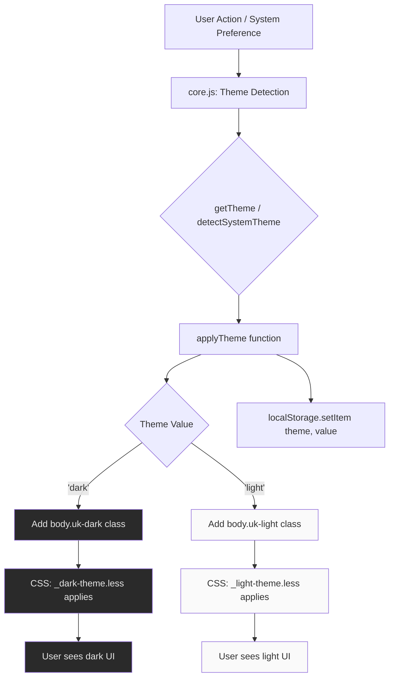

# Design Document

## Overview

This design implements a semantically correct, dual-class theme system for Mango-Rust with **consistent variable naming** and **centralized style management**. The refactoring converts the confusing backwards naming (`uk-light` for dark mode) to intuitive, modern conventions (`uk-dark` for dark mode, `uk-light` for light mode).

### Key Improvements (Based on User Feedback)

**1. Consistent Variable Naming** ✨
- **Problem**: Light variables lacked consistent prefix (`@text-primary`, `@bg-white` - ambiguous)
- **Solution**: All light variables now use `@light-` prefix (mirrors `@dark-` prefix)
- **Result**: `@light-text-primary` vs `@dark-text-primary` - instantly clear

**2. Centralized Style Management** ✨
- **Problem**: Light theme scattered across multiple files (`base.less`, `_uikit-light.less`, implicit defaults)
- **Solution**: Single source of truth for each theme:
  - `_variables.less`: ALL color tokens (light + dark)
  - `_light-theme.less`: ALL light styles (one file)
  - `_dark-theme.less`: ALL dark styles (one file)
- **Result**: Easy to find, modify, and maintain theme-specific styles

**3. Symmetric Implementation** ✨
- Both themes treated equally (no more "dark is special, light is default")
- Both themes use explicit class selectors (`body.uk-light` and `body.uk-dark`)
- Both themes use prefixed variables (`@light-*` and `@dark-*`)

The solution involves renaming CSS selectors, restructuring LESS files, standardizing variable names, and updating JavaScript theme management logic while maintaining backwards compatibility with existing user preferences.

## Steering Document Alignment

### Technical Standards (tech.md)

**N/A** - No steering documents exist for this project. Design follows established patterns found in codebase:
- LESS-based CSS architecture with modular imports
- Vanilla JavaScript for DOM manipulation (no framework dependencies)
- localStorage for client-side persistence
- UIkit CSS framework as foundation

### Project Structure (structure.md)

**Current Frontend Structure (following existing patterns):**
```
static/src/
├── css/
│   ├── _variables.less        # Design tokens (colors, spacing, typography)
│   ├── _dark-theme.less        # Dark mode overrides (currently uses body.uk-light)
│   ├── _uikit-light.less       # Light mode UIkit overrides
│   ├── base.less               # Global layout and typography
│   ├── main.less               # Entry point (import order)
│   ├── components/             # Reusable UI components
│   └── pages/                  # Page-specific styles
└── js/
    └── core.js                 # Theme management + localStorage helpers
```

## Code Reuse Analysis

### Existing Components to Leverage

- **`_variables.less`**: Already defines both light and dark color tokens
  - Light tokens: `@bg-light`, `@text-primary`, `@primary-color`, etc. (inconsistent naming)
  - Dark tokens: `@dark-bg`, `@dark-text-primary`, `@dark-border`, etc. (consistent `@dark-` prefix)
  - **Issue**: Light variables lack consistent `@light-` prefix
  - **Reuse Strategy**: Refactor to add `@light-` prefix for consistency

- **`core.js` theme functions**: Existing API structure is sound
  - `getTheme()`: Returns 'dark' or 'light'
  - `applyTheme(theme)`: Applies theme class to body
  - `toggleTheme()`: Switches between themes
  - `detectSystemTheme()`: Respects prefers-color-scheme
  - **Reuse Strategy**: Keep function signatures, update class names in implementation

- **LESS build system**: Build pipeline already compiles LESS to CSS
  - Build script: `./build-css.sh` (uses `lessc`)
  - Entry point: `static/src/css/main.less`
  - Output: `static/css/main.css`
  - **Reuse Strategy**: No changes to build process, only source files

### Integration Points

- **Templates**: No changes required
  - Templates already include compiled `main.css` and `core.js`
  - Theme logic is entirely CSS class-based
  - No server-side theme rendering

- **localStorage**: Maintains existing schema
  - Key: `'theme'`
  - Values: `'dark'` or `'light'` (no change)
  - Backwards compatible with existing user preferences

## Architecture

The refactoring uses a **dual-class explicit theme system** with **centralized variable management** where both light and dark modes are explicitly defined using CSS class selectors and consistent variable naming. This replaces the current asymmetric approach (dark = class, light = baseline).

### Key Improvements

1. **Consistent Variable Naming**: All theme-specific variables use prefixes
   - Light theme: `@light-bg`, `@light-text-primary`, `@light-border`, etc.
   - Dark theme: `@dark-bg`, `@dark-text-primary`, `@dark-border`, etc.
   - Theme-agnostic: `@primary-color`, `@accent-gold`, `@spacing-*`, etc. (no prefix)

2. **Centralized Theme Management**:
   - Single file `_variables.less`: ALL color tokens (light and dark)
   - Single file `_light-theme.less`: ALL light theme styles using `@light-*` variables
   - Single file `_dark-theme.less`: ALL dark theme styles using `@dark-*` variables
   - Base styles (`base.less`, components, pages): Use NO theme-specific colors, only structural styles

3. **Symmetric Theme Implementation**:
   - Both themes have equal file structure and naming conventions
   - Both themes are opt-in via class (`body.uk-light` or `body.uk-dark`)
   - No implicit defaults, all theming explicit

### Modular Design Principles

- **Single File Responsibility**:
  - `_light-theme.less`: ONLY light mode overrides (scope: `body.uk-light`)
  - `_dark-theme.less`: ONLY dark mode overrides (scope: `body.uk-dark`)
  - `_variables.less`: Theme-agnostic design tokens
  - `core.js`: Theme state management (no business logic mixing)

- **Component Isolation**:
  - Theme files operate independently through CSS cascade
  - No cross-dependencies between theme files
  - Variables provide shared contract (DRY principle)

- **Service Layer Separation**:
  - JavaScript: Theme detection → selection → application (pure functions)
  - CSS: Theme definition → scoped overrides (declarative)
  - localStorage: Persistence layer (separated from logic)



### CSS Cascade Strategy

**Import Order in `main.less`** (determines cascade priority):
```less
1. _variables.less       // Design tokens (no selectors)
2. base.less             // Baseline/default styles
3. _light-theme.less     // Light mode overrides (body.uk-light scope)
4. components/_nav.less  // Component styles
5. pages/*.less          // Page-specific styles
6. _dark-theme.less      // Dark mode overrides (body.uk-dark scope) - LAST
```

**Rationale**:
- Base styles provide fallback if neither theme class present
- Light theme comes before dark theme in source order
- Dark theme loads last, ensuring overrides work correctly
- Component/page styles can be themed by both light and dark selectors

## Components and Interfaces

### Component 0: Centralized Design Tokens (LESS Variables)

**File**: `static/src/css/_variables.less`

**Purpose**: Single source of truth for ALL design tokens (colors, spacing, typography) with consistent naming

**Current Problems**:
```less
// INCONSISTENT - Light variables lack prefix
@bg-light: #fafafa;              // Has "light" in name
@bg-white: white;                // No prefix
@bg-elevated: white;             // No prefix
@text-primary: #333;             // No prefix (ambiguous!)
@text-secondary: #666;           // No prefix (ambiguous!)
@border-light: #e5e5e5;          // Has "light" in name

// CONSISTENT - Dark variables have prefix
@dark-bg: rgb(20, 20, 20);       // Prefixed ✓
@dark-text-primary: #e5e5e5;     // Prefixed ✓
@dark-border: #3a3a3a;           // Prefixed ✓
```

**Refactored Structure** (consistent prefixing):
```less
// ============================================================================
// LESS Variables - Design Tokens
// Single source of truth - ALL themes defined here
// ============================================================================

// ----------------------------------------------------------------------------
// Theme-Agnostic Tokens (no prefix - shared across themes)
// ----------------------------------------------------------------------------
@primary-color: #1e87f0;         // UIKit blue (same in both themes)
@accent-gold: #c5a06d;           // Gold accent (same in both themes)
@border-radius: 5px;
@font-family: -apple-system, BlinkMacSystemFont, ...;
@spacing-sm: 20px;
// ... typography, spacing, breakpoints, z-index, transitions

// ----------------------------------------------------------------------------
// Light Theme Tokens (all prefixed with @light-)
// ----------------------------------------------------------------------------

// Backgrounds
@light-bg: #fafafa;              // RENAMED from @bg-light
@light-bg-white: white;          // RENAMED from @bg-white
@light-bg-elevated: white;       // RENAMED from @bg-elevated
@light-bg-card: #f8f8f8;         // RENAMED from @bg-card

// Text Colors
@light-text-primary: #333;       // RENAMED from @text-primary
@light-text-secondary: #666;     // RENAMED from @text-secondary
@light-text-tertiary: #999;      // RENAMED from @text-tertiary
@light-text-muted: #999;         // RENAMED from @text-muted

// UI Colors
@light-border: #e5e5e5;          // RENAMED from @border-light
@light-shadow: 0 1px 3px rgba(0,0,0,.05); // RENAMED from @shadow-light

// ----------------------------------------------------------------------------
// Dark Theme Tokens (already prefixed with @dark-)
// ----------------------------------------------------------------------------

// Backgrounds
@dark-bg: rgb(20, 20, 20);       // NO CHANGE
@dark-bg-elevated: #2a2a2a;      // NO CHANGE
@dark-bg-input: #1a1a1a;         // NO CHANGE
@dark-bg-hover: #333;            // NO CHANGE

// Text Colors
@dark-text-primary: #e5e5e5;     // NO CHANGE
@dark-text-secondary: #aaa;      // NO CHANGE
@dark-text-muted: #666;          // NO CHANGE

// UI Colors
@dark-border: #3a3a3a;           // NO CHANGE
@dark-border-light: #4a4a4a;     // NO CHANGE
```

**Benefits of Consistent Naming**:
1. **Clarity**: `@light-text-primary` vs `@dark-text-primary` - instantly obvious
2. **Searchability**: Easy to find all light variables with `grep '@light-'`
3. **Maintainability**: Adding new theme variables follows clear pattern
4. **Symmetry**: Light and dark treated equally, no implicit assumptions

**Migration Impact**:
- All existing references to unprefixed variables must be updated
- Example: `color: @text-primary;` → `color: @light-text-primary;` (in light theme file)
- Dark theme file already uses prefixed variables (no changes needed)

**Dependencies**: None (this is the foundation)

**Reuses**: Existing variable values (only names change)

---

### Component 1: Theme State Manager (JavaScript)

**File**: `static/src/js/core.js`

**Purpose**: Detect, apply, and persist theme preferences

**Interfaces**:
```javascript
// Public API (exposed globally)
getTheme(): string                    // Returns 'dark' | 'light'
applyTheme(theme: string): void       // Applies theme class, saves to localStorage
toggleTheme(): void                   // Switches between themes
detectSystemTheme(): string           // Returns 'dark' | 'light' from system

// Internal helpers
function ensureSingleThemeClass()     // Removes opposite theme class before applying new
```

**Dependencies**:
- Browser APIs: `localStorage`, `window.matchMedia`, `document.body.classList`
- No external libraries

**Reuses**: Existing function structure, localStorage key `'theme'`

**Changes**:
```javascript
// OLD (current):
if (theme === 'dark') {
    document.body.classList.add('uk-light');
} else {
    document.body.classList.remove('uk-light');
}

// NEW (refactored):
// Remove opposite theme class first
document.body.classList.remove('uk-dark', 'uk-light');
// Add correct theme class
if (theme === 'dark') {
    document.body.classList.add('uk-dark');
} else {
    document.body.classList.add('uk-light');
}
```

### Component 2: Light Theme Styles (CSS/LESS)

**File**: `static/src/css/_light-theme.less`

**Purpose**: Define light mode appearance for all UI components

**Interfaces**:
- CSS selector scope: `body.uk-light { ... }`
- Inherits from: `_variables.less` (light color tokens)

**Dependencies**:
- `@import '_variables'` (for `@bg-light`, `@text-primary`, etc.)

**Reuses**: Content from current `_uikit-light.less` + baseline styles

**Structure**:
```less
body.uk-light {
    color: @text-primary;
    background: @bg-light;

    // Navigation
    .uk-navbar-container { background: @bg-white; }

    // Forms
    .uk-input { background: white; color: @text-primary; }

    // Cards, modals, buttons, etc.
    // ... (comprehensive light theme overrides)
}
```

### Component 3: Dark Theme Styles (CSS/LESS)

**File**: `static/src/css/_dark-theme.less`

**Purpose**: Define dark mode appearance for all UI components

**Interfaces**:
- CSS selector scope: `body.uk-dark { ... }` (CHANGED from `body.uk-light`)
- Inherits from: `_variables.less` (dark color tokens)

**Dependencies**:
- `@import '_variables'` (for `@dark-bg`, `@dark-text-primary`, etc.)

**Reuses**: Existing file content (358 lines), only selector changes

**Changes**: Single find-replace operation
```less
// OLD:
body.uk-light { ... }

// NEW:
body.uk-dark { ... }
```

### Component 4: LESS Entry Point (Build Configuration)

**File**: `static/src/css/main.less`

**Purpose**: Import all LESS sources in correct cascade order

**Interfaces**:
- Build tool input (consumed by `lessc`)
- Outputs: `static/css/main.css`

**Dependencies**: All LESS partials

**Changes**:
```less
// OLD:
@import '_uikit-light';     // Line 13
@import '_dark-theme';      // Line 25

// NEW:
@import '_light-theme';     // Line 13 (renamed file)
@import '_dark-theme';      // Line 25 (no change)
```

## Data Models

### Theme Preference Model (localStorage)

**Schema**: Simple string value

```typescript
// localStorage key-value pair
{
  key: 'theme',
  value: 'dark' | 'light' | null
}

// Runtime JavaScript representation
interface ThemeState {
  saved: 'dark' | 'light' | null;     // From localStorage
  system: 'dark' | 'light';            // From matchMedia
  effective: 'dark' | 'light';         // Computed (saved ?? system)
  class: 'uk-dark' | 'uk-light';       // Applied to body
}
```

**Validation**:
```javascript
function isValidTheme(value) {
    return value === 'dark' || value === 'light';
}
```

### CSS Class State Model

**Mutually Exclusive Classes**: Only ONE of these can be active at a time
```
body.uk-dark     // Dark theme active
body.uk-light    // Light theme active
body             // Neither (fallback to base styles)
```

**State Transitions**:
```
[Load] → Check localStorage → Apply saved OR system preference
[Toggle] → Remove current → Add opposite → Save to localStorage
[System Change] → If no manual override → Apply system preference
```

## Error Handling

### Error Scenarios

1. **Scenario: localStorage unavailable (private browsing, quota exceeded)**
   - **Handling**: Graceful degradation to system theme detection
   - **Code**:
     ```javascript
     function saveTheme(theme) {
         try {
             localStorage.setItem('theme', theme);
         } catch (e) {
             console.warn('Theme preference not saved:', e.message);
             // Continue with in-memory theme (still works for session)
         }
     }
     ```
   - **User Impact**: Theme preference lost on page reload (defaults to system)

2. **Scenario: matchMedia API not supported (old browsers)**
   - **Handling**: Default to light theme
   - **Code**:
     ```javascript
     function detectSystemTheme() {
         if (window.matchMedia && window.matchMedia('(prefers-color-scheme: dark)').matches) {
             return 'dark';
         }
         return 'light';  // Safe default
     }
     ```
   - **User Impact**: System preference ignored, defaults to light

3. **Scenario: Invalid theme value in localStorage (corruption/tampering)**
   - **Handling**: Validate and fallback to system detection
   - **Code**:
     ```javascript
     function getTheme() {
         const saved = localStorage.getItem('theme');
         if (saved === 'dark' || saved === 'light') {
             return saved;  // Valid
         }
         return detectSystemTheme();  // Invalid, use system
     }
     ```
   - **User Impact**: Corrupted preference ignored, auto-detects theme

4. **Scenario: FOUC (Flash of Unstyled Content) during page load**
   - **Handling**: Apply theme class to `<html>` element before DOM ready
   - **Code**:
     ```javascript
     // IIFE runs immediately (before DOMContentLoaded)
     (function() {
         const theme = getTheme();
         const className = theme === 'dark' ? 'uk-dark' : 'uk-light';
         document.documentElement.classList.add(className);
     })();
     ```
   - **User Impact**: No flash, correct theme renders immediately

## Testing Strategy

### Unit Testing

**JavaScript Functions** (can be tested in isolation):
```javascript
// Test suite structure (if testing framework added later)
describe('Theme Management', () => {
    test('detectSystemTheme returns dark when prefers-color-scheme is dark')
    test('detectSystemTheme returns light when prefers-color-scheme is light')
    test('getTheme returns localStorage value when valid')
    test('getTheme returns detectSystemTheme when localStorage invalid')
    test('applyTheme adds uk-dark class when theme is dark')
    test('applyTheme adds uk-light class when theme is light')
    test('applyTheme removes opposite class before applying new')
    test('toggleTheme switches from dark to light')
    test('toggleTheme switches from light to dark')
});
```

**Manual Testing Checklist** (current approach):
- [ ] Browser console: `getTheme()` returns correct value
- [ ] Browser console: `applyTheme('dark')` adds `uk-dark` class
- [ ] Browser console: `applyTheme('light')` adds `uk-light` class
- [ ] Browser console: `toggleTheme()` switches classes correctly

### Integration Testing

**Theme Application Flow**:
```javascript
// Test scenarios (manual browser testing)
1. Fresh user (no localStorage):
   - Open in private/incognito window
   - Verify system theme detected
   - Verify correct class applied to body
   - Verify localStorage set after detection

2. Returning user (existing preference):
   - Set localStorage.setItem('theme', 'dark')
   - Reload page
   - Verify dark theme loads (ignores system preference)

3. Theme toggle:
   - Click theme toggle button
   - Verify class switches on body
   - Verify localStorage updates
   - Verify UI re-renders correctly

4. System theme change:
   - Clear localStorage
   - Change OS theme (System Settings)
   - Verify app follows system change
```

**CSS Theme Rendering**:
```
Test Matrix: Verify visual appearance for each theme

Components to test:
- Navigation bar (background, text colors, hover states)
- Cards (title-card, entry-card on library/book pages)
- Forms (inputs, selects, checkboxes)
- Modals (background, borders, text)
- Buttons (default, primary variants)
- Tables (headers, rows, hover states)
- Alerts (warning, success backgrounds)

For each component:
✓ Light theme: Matches light design tokens
✓ Dark theme: Matches dark design tokens
✓ No theme class: Has readable fallback
```

### End-to-End Testing

**User Scenarios** (manual browser testing):

1. **First-time visitor with dark system preference**:
   - User has macOS/Windows dark mode enabled
   - Opens Mango-Rust in browser
   - Expected: Dark theme loads immediately, no flash
   - Expected: `body` has `uk-dark` class
   - Expected: localStorage has `theme: "dark"`

2. **User manually switches to light theme**:
   - User clicks theme toggle button/icon
   - Expected: UI transitions to light theme smoothly
   - Expected: `body` class changes from `uk-dark` to `uk-light`
   - Expected: localStorage updates to `theme: "light"`
   - User refreshes page
   - Expected: Light theme persists (ignores dark system preference)

3. **User clears browser data**:
   - User clears localStorage via DevTools or browser settings
   - User refreshes page
   - Expected: System theme auto-detected again
   - Expected: Correct theme class applied

4. **Cross-page navigation**:
   - User selects dark theme on home page
   - User navigates to library page
   - Expected: Dark theme persists across navigation
   - User navigates to book page
   - Expected: Dark theme still active
   - User navigates to reader page
   - Expected: Dark theme still active (reader may have custom styling)

**Browser Compatibility Testing**:
```
Test in:
- Chrome/Edge (Chromium) - Latest
- Firefox - Latest
- Safari - Latest (macOS/iOS)

Verify:
- Theme classes apply correctly
- localStorage works
- matchMedia API works (system theme detection)
- CSS renders correctly (vendor prefixes not needed for modern features)
```

## Migration Strategy

This migration has been reorganized to address user feedback on **consistent variable naming** and **centralized style management**.

### Phase 1: Refactor Variables for Consistency
**Goal**: Add `@light-` prefix to all light theme variables in `_variables.less`

**Actions**:
1. Update `_variables.less`:
   - Rename all unprefixed light variables to use `@light-` prefix
   - Examples:
     - `@text-primary` → `@light-text-primary`
     - `@bg-white` → `@light-bg-white`
     - `@bg-elevated` → `@light-bg-elevated`
     - `@border-light` → `@light-border`
   - Keep dark variables unchanged (already have `@dark-` prefix)
   - Keep theme-agnostic variables unchanged (`@primary-color`, `@spacing-*`, etc.)

2. Update all references to renamed variables:
   - Search for old variable names in all `.less` files
   - Replace with new `@light-` prefixed names
   - Files to update: `base.less`, `_uikit-light.less`, component files, page files

**Verification**: Run `lessc` build, should compile without errors

---

### Phase 2: Centralize Light Theme Styles
**Goal**: Create comprehensive light theme file with all overrides in one place

**Actions**:
1. Create new file `_light-theme.less`:
   - Wrap all rules in `body.uk-light { ... }` scope
   - Migrate styles from `_uikit-light.less`
   - Add comprehensive light overrides (mirror structure of `_dark-theme.less`)
   - Use only `@light-*` variables for colors

2. Clean up other files:
   - Remove theme-specific colors from `base.less` (structural styles only)
   - Remove theme-specific colors from component/page files
   - All color theming should be in `_light-theme.less` or `_dark-theme.less`

3. Delete `_uikit-light.less` (content migrated to `_light-theme.less`)

**Verification**: Build CSS and visually test light theme

---

### Phase 3: Centralize Dark Theme Styles
**Goal**: Update dark theme to use semantic `body.uk-dark` selector

**Actions**:
1. Update `_dark-theme.less`:
   - Find-replace: `body.uk-light {` → `body.uk-dark {`
   - No other changes needed (already uses `@dark-*` variables)

**Verification**: CSS selector changed, but no visual changes yet (JS still uses old class)

---

### Phase 4: Update JavaScript Theme Logic
**Goal**: Map theme values to correct CSS classes

**Actions**:
1. Update `core.js`:
   - Change class application logic:
     ```javascript
     // OLD:
     if (theme === 'dark') {
         document.body.classList.add('uk-light');
     } else {
         document.body.classList.remove('uk-light');
     }

     // NEW:
     document.body.classList.remove('uk-dark', 'uk-light');
     if (theme === 'dark') {
         document.body.classList.add('uk-dark');
     } else {
         document.body.classList.add('uk-light');
     }
     ```

   - Update FOUC prevention (IIFE at top):
     ```javascript
     // OLD:
     if (theme === 'dark') {
         document.documentElement.classList.add('uk-light');
     }

     // NEW:
     const className = theme === 'dark' ? 'uk-dark' : 'uk-light';
     document.documentElement.classList.add(className);
     ```

**Verification**: Test theme toggle in browser, verify classes change correctly

---

### Phase 5: Update Build Configuration
**Goal**: Import new `_light-theme.less` file

**Actions**:
1. Update `main.less`:
   - Change line 13: `@import '_uikit-light';` → `@import '_light-theme';`
   - Verify import order:
     ```less
     @import '_variables';      // 1. Design tokens
     @import 'base';            // 2. Baseline
     @import '_light-theme';    // 3. Light theme
     @import 'components/_nav'; // 4. Components
     @import 'pages/*';         // 5. Pages
     @import '_dark-theme';     // 6. Dark theme (LAST)
     ```

**Verification**: Run `./build-css.sh`, no errors

---

### Phase 6: Comprehensive Testing
**Goal**: Verify all themes work correctly with no regressions

**Actions**:
1. Build final CSS: `./build-css.sh`
2. Manual testing per testing strategy (see Testing Strategy section)
3. Visual regression testing:
   - Compare light theme before/after (should be identical)
   - Compare dark theme before/after (should be identical)
4. Test theme persistence across page reloads
5. Test system theme detection
6. Test theme toggle functionality

**Verification**: All visual tests pass, no regressions

---

### Rollback Plan
If issues discovered post-deployment:
1. Revert `core.js` changes (restore old class names)
2. Rebuild CSS
3. Deploy reverted version
4. Investigate issues in development environment

## Backwards Compatibility

**localStorage Migration**: None needed!
- Existing localStorage schema unchanged
- Values remain `'dark'` and `'light'` (strings)
- JavaScript reads same values, just maps to different CSS classes

**User Experience**: Seamless
- Users with `theme: 'dark'` in localStorage → Still get dark theme
- Users with `theme: 'light'` in localStorage → Still get light theme
- Users with no preference → Still get system theme

**No Breaking Changes**:
- Templates not modified (no server-side changes)
- HTML structure unchanged (no new elements)
- localStorage API unchanged
- Theme toggle behavior unchanged (user-facing)
